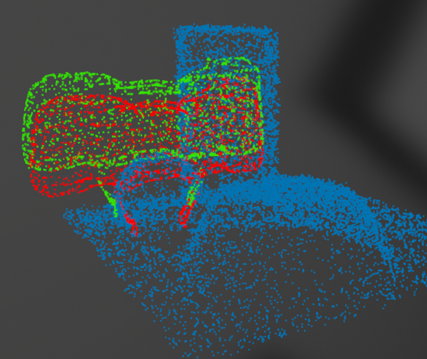

### GAG: Gripper-Aware Grasp refinement

First example of grasp refinement based on gripper configuration and pose.
Note how the gripper moves upwards to avoid collision with the ball,
it opens wider, and it rotates slightly to avoid collisions with the box.



### todo

- perhaps even merge the Ferrari Canny thing into the BURG toolkit
  - it is pretty much encapsulated anyway

## Installation

Use [anaconda](https://www.anaconda.com/), create an environment called `conv_onet` using
```
conda env create -f convonets/environment.yaml
conda activate conv_onet
```
**Note**: you might need to (just do it) install **torch-scatter** manually following [the official instruction](https://github.com/rusty1s/pytorch_scatter#pytorch-140):
```
pip uninstall torch-scatter
pip install torch-scatter==2.0.4 -f https://pytorch-geometric.com/whl/torch-1.4.0+cu101.html
```

Next, compile the extension modules and then install the package.
You can do this via
```
python setup.py build_ext --inplace
pip install -e .
```

This will also install the BURG Toolkit, which is required for dataset creation.
And perhaps later on for some visualisations.


Configuration on server end
```
conda create -n gag python=3.10
conda activate gag
conda install pytorch torchvision torchaudio pytorch-cuda=11.7 -c pytorch -c nvidia
conda config --append channels conda-forge
conda install cython pandas pyembree

pip install https://github.com/mrudorfer/burg-toolkit/archive/refs/heads/dev.zip
pip install pykdtree plyfile tensorboardX gdown wandb
pip install torch-scatter -f https://data.pyg.org/whl/torch-2.0.1+cu117.html

python setup.py build_ext --inplace
pip install -e .
```
I highly recommend using wandb for logging your runs. Create a wandb account, create a project there and put your API key to following command:
```https://wandb.ai/home```
```
wandb login
```
